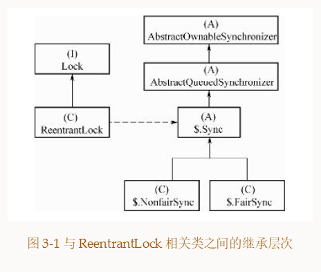

1.ReentrantLock  可重入 可中断的锁
这个可以和Synchronied进行比价Syn也是可重入的锁 但是是不可以被中断的(也就意味着线程被重阻塞)
ReentrantLock 类的结构

2.重要的锁实现
https://www.jianshu.com/p/1014fdd375cf  
Condition配合ReentrantLock可以实现synchronized的wait、notify类似的功能。并且功能比synchronized更加强大，能够实现中断、限时

ReentrantLock
3.讲一讲condition的底层原理
https://blog.csdn.net/qq_33996921/article/details/106629546
  条件队列和阻塞队列的节点，都是 Node 的实例，因为条件队列的节点是需要转移到阻塞队列中去的；
     我们知道一个 ReentrantLock 实例可以通过多次调用 newCondition() 来产生多个 Condition 实例，
  这里对应 condition1 和 condition2。注意，ConditionObject 只有两个属性 firstWaiter 和 lastWaiter；
     每个 condition 有一个关联的条件队列，如线程 1 调用 condition1.await() 方法即可将当前线程 1 包装成 Node 后加入到条件队列中，
     然后阻塞在这里，不继续往下执行，条件队列是一个单向链表；
  调用condition1.signal() 触发一次唤醒，此时唤醒的是队头，会将condition1 对应的条件队列的 
    firstWaiter（队头） 移到阻塞队列的队尾，等待获取锁，获取锁后 await 方法才能返回，继续往下执行。
    
    
4.ReentrantLock 锁获取和释放的简单说明
   其实我们讲获取锁 是什么意思呢
   对于独占锁ReentrantLock 就是获取state 然后修改进行+1 可以重入 加入其它线程已经修改过了 就无法再次使用
   对于共享锁就是同理 只是条件不一样了 
   获取锁的时候将当前线程放入同步队列，并且将前一个节点的状态置为signal状态，然后阻塞   (此处说明为什么要有一个空的头节点了)
   当这个节点的前一个节点成功获取到锁，前一个节点就成了整个同步队列的head。
   当前一个节点释放锁的时候，它就唤醒当前线程的这个节点，然后当前线程的节点就可以成功获取到锁了
   这个时候它就到整个队列的头部了，然后release操作的时候又可以唤醒下一个。